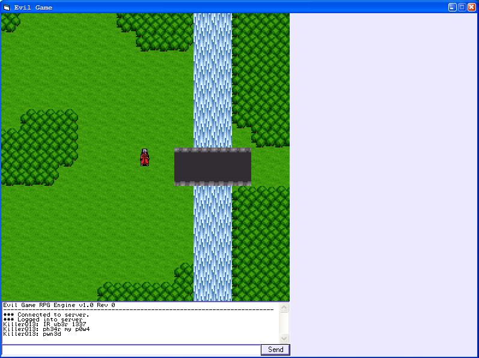

<div align="center">

## Evil Game Rev 1


</div>

### Description

*** Online RPG Engine *** Tile based RPG engine with Winsock TCP/IP for connectivity. Comes with client, server, map editor, and resource editor. Uses GDI API and double buffering to display map. Should work on all Windows platforms. Features include: Animations, interchangable map file format, full tileset support, WYSIWYG map editor, chat system, and a multiplayer environment. There are no actions available as this would set the style of the RPG (although I probably will implement an object system later). Think of this as a kit to develop an online RPG.
 
### More Info
 


<span>             |<span>
---                |---
**Submitted On**   |2004-02-18 02:12:22
**By**             |[Keith Weimer](https://github.com/Planet-Source-Code/PSCIndex/blob/master/ByAuthor/keith-weimer.md)
**Level**          |Advanced
**User Rating**    |5.0 (15 globes from 3 users)
**Compatibility**  |VB 5\.0, VB 6\.0
**Category**       |[Games](https://github.com/Planet-Source-Code/PSCIndex/blob/master/ByCategory/games__1-38.md)
**World**          |[Visual Basic](https://github.com/Planet-Source-Code/PSCIndex/blob/master/ByWorld/visual-basic.md)
**Archive File**   |[Evil\_Game\_1710592182004\.zip](https://github.com/Planet-Source-Code/keith-weimer-evil-game-rev-1__1-51856/archive/master.zip)

### API Declarations

```
' GDI32 calls and CopyMemory
```


